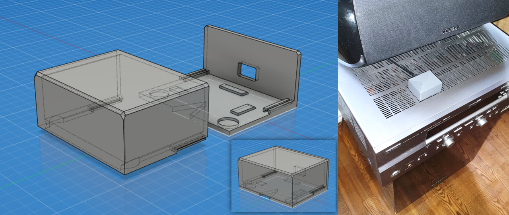
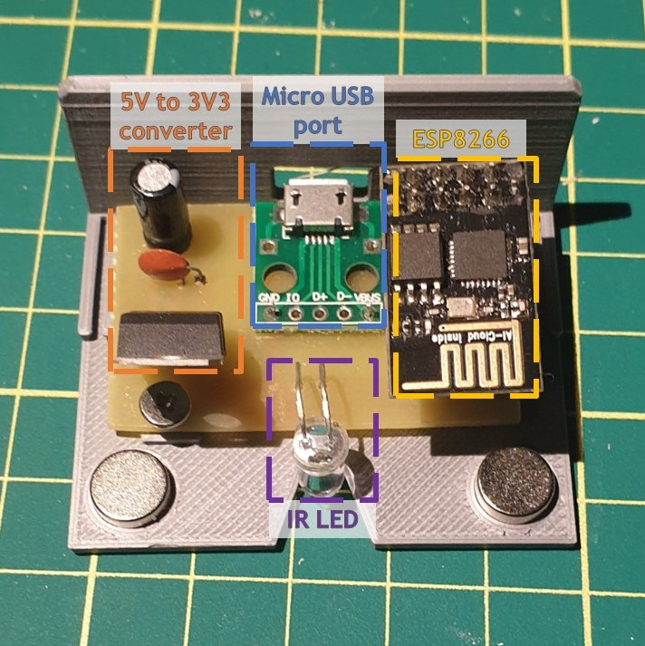

# Infrared IoT Device For Echo Dot

A custom IoT device that toggles a Yamaha AV Receiver with an infrared LED. It communicates with
Echo Dot Alexa (smart speaker with a virtual assistant) through SINRIC PRO API, so you can switch the AV with voice commands. Uses an ESP8266 Wi-Fi microcontroller, programmed with C++.

## IoT Device (CAD & IRL)
The IoT device is placed on top of the Yamaha AV receiver and emits infrared light through the gaps in the chassis and luckily can hit the AV's sensor inside.

## Controlling With Voice
I only need to tell my virtual assistant Alexa to turn on the device or group of devices (since I also have a bass booster bellow the AV that is connected to a purchased smart socket) and everything toggles, ready for playing music through Bluetooth or Spotify. Afterwards, I just tell Alexa to turn off everything and the AV and bass booster are turned off.

## The Circuit Board
The circuit consists of few main parts: the Wi-Fi controller ESP8266, an IR LED, a converter from around 5V that an old phone charger supplies to 3V3, the supply voltage supported by the controller. There’s also a connector for a micro-USB cable.

